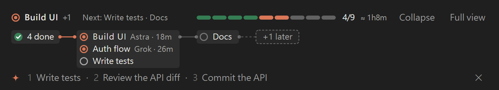
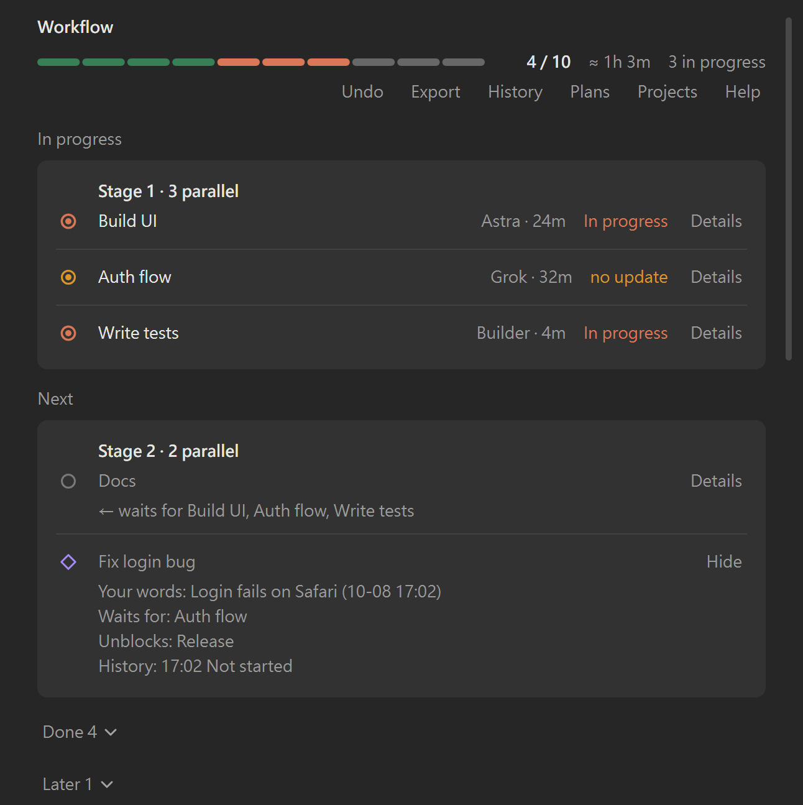

# workflow-map

**See what your AI is doing — and what's next.** A live plan for Claude Code, right above your prompt.


▶ [Watch the intro in full quality (MP4, 22 s)](docs/intro.mp4)

## What it does

- **One row above the prompt** — the step that is running, what comes next, and a segmented progress bar (`3/9`).
- **Expand for the card graph** — GitHub-Actions-style cards: finished work folded into "✓ N done", parallel steps stacked in one card, later steps folded into a dashed "+N later" card at the end of the line. Point at "✓ N done" or "+N later" to peek at the steps inside.
- **Your interjections are kept** — when you ask for something mid-plan, Claude records it as a violet ◇ step (with the time and your words) before acting on it, so it doesn't get lost.
- **Full view on demand** — `/workflow` opens stage-by-stage cards, showing what each waiting step is waiting for. Press **Details** on a step to see more: your original words, what it waits for and unblocks, owner, start/finish times and its status history.
- **Made for several agents** — each step can have an **owner** (Builder, Grok, "me"…), shown as a small tag with the time it has taken. Start a sub-agent with `[wm:<id>]` in its description and its step turns *in progress* on its own, then *done* (or *blocked* if the agent failed). A step in progress with no update for 30 minutes turns amber ("no update").
- **One plan per session** — two Claude Code sessions in the same project each keep their own plan. To work on the same plan, open **Plans** in the full view and press **Join** (or run `/workflow join <title>`); `/workflow leave` goes back to your own.
- **Plans come and go** — when you start an unrelated task, the old plan moves to **History** (in the full view) instead of mixing with the new one; a plan another session is still using is never archived.
- **Notifications** — a short notification when a sub-agent finishes a step, when a step becomes blocked, or when a step in progress goes stale; several at once are merged into one.
- **Time left** — once three finished steps have timings, the band and the full view show an estimate (`≈ 40m`): the median step time × the remaining stages (parallel steps count once per stage).
- **Export, undo, projects** — `/workflow export` (or **Export** in the full view) writes the plan as Markdown to `.claude/workflow-map.export.md` and copies it, ready for a hand-off note or a PR description. `/workflow undo` (or **Undo**) restores the plan as it was before the last change, the AI's changes included (last 10 kept). **Projects** lists your other projects that have a plan and opens any of them read-only.
- **Next-prompt suggestions** — after each answer, the band's last row offers up to three likely next prompts (ready plan steps first). Press `1`, `2` or `3` to put one in the prompt box as a draft you can edit, `0` to hide them. Nothing is ever sent for you.

| Collapsed | Expanded |
|---|---|
|  |  |



<sub>The collapsed and expanded rows are rendered by the plugin's own drawing code (dark theme). In the full view the app lays out the cards itself; that picture is rendered from the plugin's element tree with an approximation of the app's layout.</sub>

## Install

Requires **Claude Code 2.1.287 or later**.

### Desktop app

Settings → Plugins → **Add from a repository** → enter `mimateinn/workflow-map`.

### Inside a Claude Code session

```
/plugin install workflow-map --marketplace mimateinn/workflow-map
```

### From your shell

```sh
claude plugin install workflow-map --marketplace mimateinn/workflow-map
```

Or in two steps (add the marketplace, then install from it):

```sh
claude plugin marketplace add mimateinn/workflow-map
claude plugin install workflow-map@workflow-map
```

Add `--scope project` to install for the current project only (default: `user`).

### Install with one prompt

Paste this into Claude Code and it will install the plugin for you:

```text
Install the Claude Code plugin "workflow-map" from the GitHub marketplace mimateinn/workflow-map.
Run: claude plugin install workflow-map --marketplace mimateinn/workflow-map
If that command is not available, run `claude --version` and tell me — it needs 2.1.287 or later.
When it succeeds, confirm with `claude plugin list` and tell me to restart Claude Code if the map does not appear.
```

To try it without a real plan, run `/workflow-demo` (shows a sample; run it again to hide it).

## How it works

- The plugin gives Claude a `workflow_map` tool (`new_plan` / `set_plan` / `upsert` / `status` / `insert` / `remove` / `show`) plus a short system-prompt note (about 80 words): keep the map current for work of more than three steps, start a `new_plan` for an unrelated task, record your mid-plan requests with `insert` first, and tag delegated agents with `[wm:<id>]`. Tool answers are kept short — a one-line summary plus the steps that changed — so the map costs few tokens.
- The map is stored in your project at **`.claude/workflow-map.json`**, so later sessions and other agents can read it. Updates that would create a cycle or point to a missing step are rejected and the map is left unchanged. A damaged file is backed up before the map restarts.
- **Safe with other writers:** before writing, the plugin reads the file again and merges step by step (the newer change wins; deleted steps stay deleted), so a Codex or Grok session editing the same plan doesn't lose its changes. The format, merge rules and history folder are documented in **[docs/FORMAT.md](docs/FORMAT.md)** for tools that want to read or write the plan.
- **History:** finished or replaced plans are kept in `.claude/workflow-map.history/`, one file per plan; the full view lists them under **History**. Files from older versions are backed up once and upgraded in place, never trimmed.
- **The amber dot** after the count means you sent a request that isn't on the map yet. Short replies like "ok", "go on" or "好" and image-only messages don't count.
- **Focus mode:** with more than six steps, only what's running, what's ready and the next level are drawn; done and far-future steps fold into one card each. Steps you inserted this turn are always shown.
- **Language follows you:** the interface uses the script of your most recent prompt: Traditional Chinese, Japanese or Korean, otherwise English (Simplified Chinese gets the English interface). Spanish, French and German are available through the `language` option. Step titles are shown as Claude wrote them.
- **Suggestions** come from one extra short model call per answer (a fork of the session, so it shares the prompt cache); the plan's ready steps fill the slots first, and with three ready steps no call is made.
- **Help:** press **?** at the top right of the full view, or run `/workflow help`, for a short guide with the icon legend.
- `/workflow export` and `/workflow undo` do the same as the **Export** and **Undo** buttons; `/workflow join <id or title>` and `/workflow leave` switch this session's plan.
- **Upgrading from 0.3.0:** the old shared file `.claude/workflow-map.json` is left exactly as it is and becomes the plan called `default`; a session sees it only after joining it.
- `/workflow` — open the full map (registered as `/workflow-map` if another plugin already owns `/workflow`). `/workflow-demo` — toggle a sample map (on screen only, nothing is written).
- In the terminal the map is drawn as text (a one-line summary that expands into a step list).
- The map hides when there is no plan, and hides itself again shortly after everything is done.

## Options

| Option | Values | Default |
|---|---|---|
| `language` | `auto`, `en`, `zh-Hant`, `ja`, `ko`, `es`, `fr`, `de` | `auto` (script of your latest prompt; English when unsure) |
| `suggestions` | `true`, `false` | `true` (next-prompt suggestions as the band's last row) |
| `notify` | `true`, `false` | `true` (notifications for finished, blocked and stale steps) |
| `staleMinutes` | `0`–`1440` | `30` (a step in progress with no update for this long turns amber; `0` turns it off) |

Set it in the plugin's settings, or from the shell:

```sh
claude plugin configure workflow-map                                   # show options
echo '{"language":"en"}' | claude plugin configure workflow-map --values-stdin
```

## Privacy

The map lives in local files in your project (`.claude/workflow-map.json` and the `.claude/workflow-map.history/` folder). The plugin makes no network requests of its own; the only model use is the suggestions' one short fork per answer, made through Claude Code like any other turn (turn it off with `suggestions: false`).

## Development

```sh
claude plugin validate .
claude plugin test .
```

## License

MIT — see [LICENSE](LICENSE).

The next-prompt suggestions are derived from [next-steps](https://github.com/anthropics/claude-plugins-community) by Thariq Shihipar / Anthropic, licensed under Apache-2.0 — see [NOTICE](NOTICE) and [LICENSE-APACHE](LICENSE-APACHE).

---

## 繁體中文

**workflow-map** 在 Claude Code 輸入框上方以一行顯示目前工作：正在做甚麼、下一步、分段進度條。按 ˅ 展開成卡片圖（已完成收成「✓ N 已完成」、並行步驟疊在同一張卡）；輸入 `/workflow` 開啟全圖。你中途提出的要求會先以紫色菱形 ◇ 記錄下來，不會被遺忘。每一步可標示負責人（Builder、Grok、me…）和用時；派子代理時在描述寫 `[wm:<步驟 id>]`，步驟會自動變成進行中、完成（或出錯時受阻）；進行中超過 30 分鐘沒有更新會變琥珀色（「久未更新」，可用 `staleMinutes` 調整）。全圖每一步按「詳情」可看：你的原話、等待／完成後可開始的步驟、負責人、時間、狀態紀錄。開始另一件工作時，舊計劃移到「歷史紀錄」。資料只存於專案的 `.claude/workflow-map.json` 和 `.claude/workflow-map.history/`，不連網；檔案格式見 [docs/FORMAT.md](docs/FORMAT.md)（英文），其他工具（Codex、Grok）可按規則安全地一同讀寫。子代理完成、步驟受阻或久未更新時會彈出簡短通知（`notify` 可關）；有三個以上已完成步驟有時間時顯示估計剩餘時間（≈ 40 分鐘）；`/workflow export`（或全圖的「匯出」）把計劃寫成 Markdown 並複製；`/workflow undo`（或「還原」）還原上一次修改；「專案」列出其他有計劃的專案，可唯讀查看。每個工作階段有自己的計劃，同一個專案的兩個工作階段互不干擾；想一起用同一份計劃，在全圖按「計劃」→「加入」（或 `/workflow join <標題>`），`/workflow leave` 離開。舊版的共用檔 `.claude/workflow-map.json` 原封不動，成為名叫 `default` 的計劃，加入了才會看見。每次回答後，橫條最後一行會建議最多三句下一步（計劃中可開始的步驟優先），按 1／2／3 放入輸入框（不會自動送出），0 收起；可用 `suggestions` 關閉。介面語言跟隨你最近一次輸入的文字（繁中、日文、韓文，其餘英文；簡體用英文介面），亦可在設定 `language` 指定英文、繁中、日文、韓文、西班牙文、法文或德文。建議功能改編自 Anthropic 的 next-steps（Apache-2.0，見 NOTICE）。

安裝（需要 Claude Code 2.1.287 或以上）：

- 桌面版：設定 → Plugins → Add from a repository → `mimateinn/workflow-map`
- 對話內：`/plugin install workflow-map --marketplace mimateinn/workflow-map`
- 終端機：`claude plugin install workflow-map --marketplace mimateinn/workflow-map`

全圖右上角的 **?**（或輸入 `/workflow help`）有簡短說明和圖示解釋。想先看效果：輸入 `/workflow-demo`（只在畫面顯示，不寫入任何檔案）。
